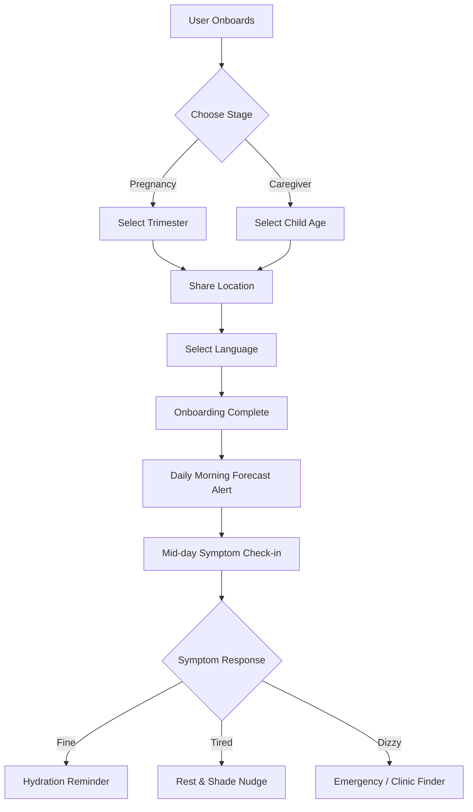

# WhatsApp Chatflow Templates — dayli.ai

This document outlines the standard interactive WhatsApp message templates and conversational flow logic used by the **dayli copilot**. These templates are calibrated for the WhatsApp Business API (using interactive buttons, quick replies, and list menus) and comply with WHO and pediatric health guidelines.

---

## 🗺️ Conversational Flow Overview

---

## 1. Onboarding Flow (Initial Setup)

### Template 1.1: Welcome & Consent
* **Type**: Interactive Utility Template (Button)
* **Copy**:
> Hello! Welcome to **dayli** — your AI Climate Health Copilot. 🌸👶
> 
> We deliver personalized local weather, UV, and air quality guidelines directly here to protect you, your pregnancy, and your children.
> 
> To get started, please tap the button below to review and accept our privacy policy.
* **Buttons**:
  * `[ Accept & Start ]`
  * `[ Read Privacy Policy ]`

### Template 1.2: Stage Identification
* **Type**: Interactive List Template
* **Copy**:
> Great! Let's personalize your copilot.
> 
> Which category best describes your current health profile? Please select one from the menu below:
* **List Menu Section**: **Health Stage**
  * `Pregnant (1st/2nd Trimester)`
  * `Pregnant (3rd Trimester)`
  * `Mother / Caregiver of Infant (0-12 months)`
  * `Mother / Caregiver of Toddler (1-5 years)`
  * `Other / Supporter`

### Template 1.3: Location Capture
* **Type**: Location Request Message
* **Copy**:
> Next, I need to track the climate conditions in your immediate area. 
> 
> Please tap **Share Location** below to send your current GPS coordinates, or type your City/Zip Code.
* **Action**: `[ Send Location ]` (Native WhatsApp GPS request)

### Template 1.4: Onboarding Completed
* **Type**: Standard Text Message with Quick Replies
* **Copy**:
> Setup complete! 🎉 
> 
> I will send you a brief environmental advisory every morning for **{{Location}}**, and check in on you if temperatures or air pollution levels spike.
> 
> You can also ask me health questions anytime (e.g. type *"heat protection"* or *"air quality tips"*).
* **Buttons**:
  * `[ Show Current Weather ]`
  * `[ Hydration Guide ]`

---

## 2. Daily Morning Bulletins (Proactive Climate Alerts)

Sent automatically at 8:00 AM based on the daily forecast.

### Flow 2.1: Low Risk (Safe Conditions)
* **Trigger**: Feels-like temp < 27°C, AQI < 50, UV < 3
* **Copy**:
> Good morning! 🌤️ Here is today's dayli climate feed for **{{City}}**:
> 
> • Apparent Temp: **{{FeelsLike}}°C** (Safe)
> • Air Quality: **{{AQI}}** (Good)
> • UV Index: **{{UV}}** (Low)
> 
> **Maternal & Child Guide**:
> Conditions are healthy today. We recommend outdoor playtime for children and standard prenatal hydration (about 2.5 Liters). Have a wonderful day!

### Flow 2.2: Moderate Risk (Caution Heat/AQI/UV)
* **Trigger**: Feels-like 27-32°C OR AQI 50-100 OR UV 3-7
* **Copy**:
> Good morning. ⚠️ Today's environment levels in **{{City}}** require caution:
> 
> • Apparent Temp: **{{FeelsLike}}°C** (Elevated)
> • Air Quality: **{{AQI}}** (Moderate)
> • UV Index: **{{UV}}** (High)
> 
> **Maternal & Child Guide**:
> • **Mothers**: Apparent temperatures are rising. Increase your fluid intake (aim for 3L today). Apply SPF 30+ to prevent sun-induced skin melasma.
> • **Children**: Apply sunscreen before outdoor play. Restrict heavy physical activity to early mornings or late evenings.

### Flow 2.3: High Risk (Dangerous Climate Stress)
* **Trigger**: Feels-like > 32°C OR AQI > 100 OR UV > 7
* **Copy**:
> 🚨 **CRITICAL HEALTH ALERT** for **{{City}}** today:
> 
> • Apparent Temp: **{{FeelsLike}}°C** (Dangerous)
> • Air Quality: **{{AQI}}** (Unhealthy / PM2.5: **{{PM2.5}}**µg)
> • UV Index: **{{UV}}** (Very High)
> 
> **Maternal & Child Guide**:
> • **Mothers**: Heat increases maternal core temperature and raises dehydration risks, which can trigger pre-term labor contractions. Stay indoors with air conditioning, and drink 3.5L of water today.
> • **Children**: Kids absorb air pollutants faster than adults. Keep all windows closed, run air purifiers, and suspend outdoor playtime.
* **Buttons**:
  * `[ How to stay cool ]`
  * `[ Emergency Checklist ]`

---

## 3. Mid-Day Symptom Check-Ins (Active Risk Engagement)

Sent at 2:00 PM during Moderate/High risk days.

### Flow 3.1: Check-in Question
* **Type**: Interactive Quick Reply Message
* **Copy**:
> Hi there, checking in from dayli. 🌸 
> 
> The heat is peaking right now in **{{City}}** at **{{FeelsLike}}°C**. 
> 
> How are you and your little ones feeling?
* **Buttons**:
  * `[ Fine ]`
  * `[ Tired / Fatigued ]`
  * `[ Dizzy / Nauseous ]`

---

### Conversational Response Logic:

#### Option A: User selects `[ Fine ]`
* **Copy**:
> Good to hear! Even when feeling fine, heat stress is cumulative. 
> 
> Please ensure you continue to drink fluids. If you are pregnant, make sure you've had at least 8 cups of water by this hour. Keep kids in shaded or cool spaces. 🥤

#### Option B: User selects `[ Tired / Fatigued ]`
* **Copy**:
> 😴 Heat fatigue indicates your body is working double-time to thermoregulate. 
> 
> **Action Steps**:
> 1. Stop physical activities immediately.
> 2. Sit or lie down in an air-conditioned room or in front of a fan.
> 3. Sip cool water, coconut water, or ORS fluids.
> 
> We will check in on you again in 2 hours. If fatigue turns to vomiting or muscle cramps, contact your doctor.

#### Option C: User selects `[ Dizzy / Nauseous ]`
* **Type**: Call-to-Action Template
* **Copy**:
> 🚨 **WARNING: Potential Heat Exhaustion / Dehydration.**
> 
> Dizziness can lead to dangerous blood pressure drops in pregnancy and is a key red flag.
> 
> **Immediate Action Required**:
> 1. Lie down immediately in a cooled room with your feet elevated.
> 2. Sip water with electrolytes (ORS / Pedialyte).
> 3. Apply cool, wet towels to your forehead, neck, and underarms.
> 
> 📞 If symptoms worsen, or if you experience labor contractions, call your emergency clinic or doctor immediately.
* **Buttons**:
  * `[ Find Nearest Clinic ]`
  * `[ Call Local Emergency ]`

---

## 4. Inbound Clinical Queries (User-Initiated)

Triggered when users text specific terms to the WhatsApp account.

### Trigger: "dehydration" / "water"
> 💧 **Hydration Guidelines**:
> 
> • **Pregnancy (Trimester 3)**: You need 3.0 Liters (12 cups) daily. Increase this by 0.5L for every hour of outdoor heat index >30°C.
> • **Infants < 6 months**: Do NOT give infants water. It can dilute essential electrolytes. They only need breastmilk or formula (which adjusts naturally to heat).
> • **Toddlers / Children**: Offer water every 20 minutes during play. Watch for dry lips or less than 4 wet diapers in 24 hours.

### Trigger: "air quality" / "smoke" / "aqi"
> 💨 **Air Quality & Smoke Protection**:
> 
> • **Pregnancy**: High PM2.5 levels trigger systemic inflammation and cross the placenta. Run HEPA air filters inside and wear a tight-fitting N95 mask if travel is mandatory.
> • **Kids**: Young lungs breathe twice as fast, drawing in double the pollutants. Do not allow outdoor play when AQI is >100.
> • **Respirators**: Do not put masks on children under 2 years of age due to suffocation risks.

### Trigger: "red flags" / "danger"
> 🚨 **Red Flag Warning Signs**:
> 
> Seek immediate emergency medical care if you witness:
> 
> • **Pregnant Mother**: Contractions, chest pain, rapid heart rate, severe vomiting, or sudden decrease in baby's movement.
> • **Infant/Child**: High fever, extreme drowsiness (unable to wake up), rapid or grunting breaths (ribs pulling in), or vomiting everything they drink.
